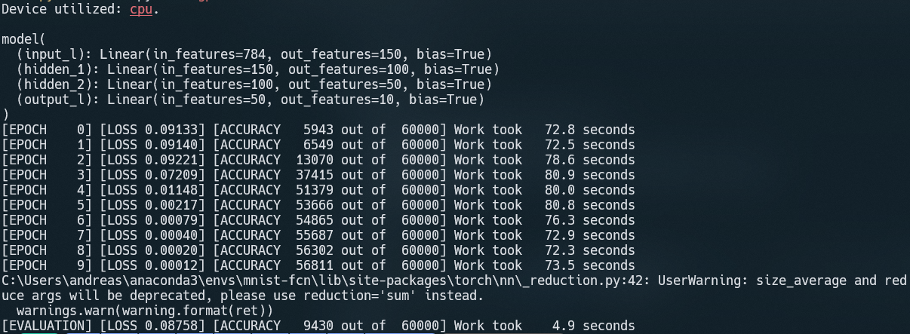

# Feed Forward Neural Network in PyTorch

## Prerequisites 

1. Have `Anaconda` installed. 

## Installation

1. `conda create --name mnist-fcn python=3.8 pip`
2. `conda activate mnist-fcn`
3. `conda install pytorch torchvision torchaudio cudatoolkit=11.3 -c pytorch`
4. `conda install matplotlib`

## Execution

To train the implemented model, use `python train.py --no-gpu`. To get more familiar with the script, use `python train.py --help`. You can also visualize some samples by passing the option `--visual`.

## Results 

An example of execution is:

